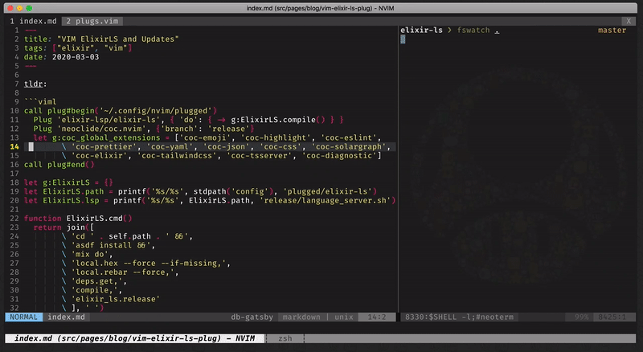
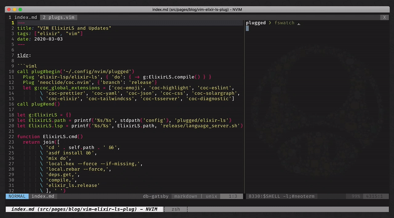

[Kassio's Post] was inspirational, and I adapted from his setup. My setup is a
little different from his:

* I use [asdf] to manage my installed Elixir and Erlang versions. The ElixirLS
    project has a tested Elixir version it was developed with; and I'd like to
    use that same version. I also don't want to have to worry about not having
    the same installed versions as them.
* I use [vim-plug]. It has a neat feature where you can clone any repository
    whether or not it's built for vim or not. In this case, I'm going to use it
    to grab a copy of ElixirLS, and have it run a post-update hook. ElixirLS
    doesn't have any vim code that gets loaded, so it's benign.
* I wanted to let the compilation happen asynchronously. I don't want
    compilation to lock up the UI.

## The Proof

Here's [ElixirLS] in action inside vim with [nvim.coc]:


Here's me manually calling to update ElixirLS. I have a terminal on the right
that is watching the filesystem so we can see it's actually doing something:



Here's me using vim-plug to update ElixirLS. I have a terminal on the right
that is watching the filesystem so we can see it's actually doing something:



## The Vimscript

Here's the vim setup:

```vim
call plug#begin('~/.config/nvim/plugged')
  Plug 'elixir-lsp/elixir-ls', { 'do': { -> g:ElixirLS.compile() } }
  Plug 'neoclide/coc.nvim', {'branch': 'release'}
call plug#end()

let g:coc_global_extensions = ['coc-elixir', 'coc-diagnostic']

let g:ElixirLS = {}
let ElixirLS.path = stdpath('config').'/plugged/elixir-ls'
let ElixirLS.lsp = ElixirLS.path.'/release/language_server.sh'
let ElixirLS.cmd = join([
        \ 'asdf install &&',
        \ 'mix do',
        \ 'local.hex --force --if-missing,',
        \ 'local.rebar --force,',
        \ 'deps.get,',
        \ 'compile,',
        \ 'elixir_ls.release'
        \ ], ' ')

function ElixirLS.on_stdout(_job_id, data, _event)
  let self.output[-1] .= a:data[0]
  call extend(self.output, a:data[1:])
endfunction

let ElixirLS.on_stderr = function(ElixirLS.on_stdout)

function ElixirLS.on_exit(_job_id, exitcode, _event)
  if a:exitcode[0] == 0
    echom '>>> ElixirLS compiled'
  else
    echoerr join(self.output, ' ')
    echoerr '>>> ElixirLS compilation failed'
  endif
endfunction

function ElixirLS.compile()
  let me = copy(g:ElixirLS)
  let me.output = ['']
  echom '>>> compiling ElixirLS'
  let me.id = jobstart('cd ' . me.path . ' && git pull && ' . me.cmd, me)
endfunction

" If you want to wait on the compilation only when running :PlugUpdate
" then have the post-update hook use this function instead:

" function ElixirLS.compile_sync()
"   echom '>>> compiling ElixirLS'
"   silent call system(g:ElixirLS.cmd)
"   echom '>>> ElixirLS compiled'
" endfunction


" Then, update the Elixir language server
call coc#config('elixir', {
  \ 'command': g:ElixirLS.lsp,
  \ 'filetypes': ['elixir', 'eelixir']
  \})
call coc#config('elixir.pathToElixirLS', g:ElixirLS.lsp)
```

And this is in my `:CocConfig` (`~/.config/nvim/coc-settings.json`):

```json
{
  "codeLens.enable": true,
  "diagnostic-languageserver.filetypes": {
    "elixir": ["mix_credo", "mix_credo_compile"],
    "eelixir": ["mix_credo", "mix_credo_compile"]
  }
}
```

## Include coc.nvim, ElixirLS in plug

Starting from the top:

```vim
call plug#begin('~/.config/nvim/plugged')
  Plug 'elixir-lsp/elixir-ls', { 'do': { -> g:ElixirLS.compile() } }
  Plug 'neoclide/coc.nvim', {'branch': 'release'}
call plug#end()

let g:coc_global_extensions = ['coc-elixir', 'coc-diagnostic']
```

I'm using vim-plug to grab some plugins. All we care about for now is coc.nvim
and elixir-ls. I'm providing options for elixir-ls to perform an after-update
action. In this case, a lambda which immediately evaluates `{ 'do': { -> g:ElixirLS.compile() } }`

To learn more about the vim lambda, check out `:h expr-lambda`. We're going to
look at the `ElixirLS.compile()` function later.

The coc.nvim setup is straight from their readme. I'm also adding some
extensions that nvim.coc will install on its own after startup. In this case I
want [coc-elixir] and [coc-diagnostic].

coc-elixir provides coc.nvim the settings to know how to work with Elixir
projects and the language server. It also will build ElixirLS on its own, but
we're going to circumvent that in a moment.

coc-diagnostic is a generic bridge for many non-Language-Server tools like
shellcheck and credo. In this case, I'm adding it for credo. I don't need
coc-diagnostic to provide a formatter, since the main Elixir language server
will provide that already.

## Define your vim ElixirLS dictionary

Next we're going to create a dictionary with a couple of functions. This dict is
going to manage several things for us:

* The path to the language server executable and directory.
* The commands to run when needing to compile
* Job hook functions so Neovim can run this task asynchronously

Check out `:h dictionary-function` in vim for more info on how to be a bit more
object-oriented in your vim scripts. If you go down this rabbit hole, I really
encourage you to look into `:h lua` as well which is better-suited for serious
vim programming.

```vim
let g:ElixirLS = {}
let ElixirLS.path = stdpath('config').'/plugged/elixir-ls'
let ElixirLS.lsp = ElixirLS.path.'/release/language_server.sh'
let ElixirLS.cmd = join([
        \ 'asdf install &&',
        \ 'mix do',
        \   'local.hex --force --if-missing,',
        \   'local.rebar --force,',
        \   'deps.get,',
        \   'compile,',
        \   'elixir_ls.release'
        \ ], ' ')
```

So far it's pretty standard stuff. We initialize an empty global dictionary
first, then start stuffing some values in there. We're using the function
`stdpath` so we avoid hard-coding any paths.

The `join([...], ' ')` is only a way to organize the commands in a visual way.
It's not necessary; you can totally just concat some strings together. The end
result of this join is:

```sh
asdf install && mix do local.hex --force --if-missing, local.rebar --force, deps.get, compile, elixir_ls.release
```

Since I'm using [asdf] and [so are the ElixirLS
developers](https://github.com/elixir-lsp/elixir-ls/blob/master/.tool-versions)
I want to make sure I'm using the ElixirLS developers' tools so I know for sure
I won't run into trouble while developing; I want my ElixirLS to be stable since
it's such an important tool for me.

We're going to leverage [mix do] so we're not starting Elixir fresh for each
command. This should speed some things up.

## Run it in the background

```vim
function ElixirLS.on_stdout(_job_id, data, _event)
  let self.output[-1] .= a:data[0]
  call extend(self.output, a:data[1:])
endfunction

let ElixirLS.on_stderr = function(ElixirLS.on_stdout)

function ElixirLS.on_exit(_job_id, exitcode, _event)
  if a:exitcode[0] == 0
    echom '>>> ElixirLS compiled'
  else
    echoerr join(self.output, ' ')
    echoerr '>>> ElixirLS compilation failed'
  endif
endfunction

function ElixirLS.compile()
  let me = copy(g:ElixirLS)
  let me.output = ['']
  echom '>>> compiling ElixirLS'
  let me.id = jobstart('cd ' . me.path . ' && git pull && ' . me.cmd, me)
endfunction
```

These functions are adding keys to the ElixirLS dictionary. If I echo out the
dictionary, you'll see a normal dictionary with some funcrefs.

```vim
:echo ElixirLS
{
  'cmd': 'asdf install && mix do local.hex --force --if-missing, local.rebar --force, deps.get, compile, elixir_ls.release',
  'path': '/home/me/.config/nvim/plugged/elixir-ls',
  'on_exit': function('2'),
  'on_stdout': function('1'),
  'lsp': '/home/me/.config/nvim/plugged/elixir-ls/release/language_server.sh',
  'on_stderr': function('1', {...@0}),
  'compile': function('3')
}
```

One of the great things about Neovim (and Vim8+) is that it really pushed
asynchronous work forward. Neovim introduced some functions to manage background
jobs. The one we end up using is `jobstart({cmd}[, {opts}])` (check out `:h jobstart`).
**Heads up** this is for Neovim; Vim8 has a different API for asynchronous
work. It's still `jobstart` but the options are different, so be sure to check
out `:h job-options`.

```vim
function ElixirLS.compile()
  let me = copy(g:ElixirLS)
  let me.output = ['']
  echom '>>> compiling ElixirLS'
  let me.id = jobstart('cd ' . me.path . ' && git pull && ' . me.cmd, me)
endfunction
```

First we're going to make a copy of the dictionary since this can be
asynchronous; we'll call it `me`. Then we'll initialize a new key `output` so we
can store all the background job's output into it. Lastly, we'll start the job.
The first argument (if a string) will shell out and execute the command you fed
it.

Here's the complete command that ends up being sent:

```sh
cd {the-path} && \
  git pull && \
  asdf install && \
  mix do local.hex --force --if-missing, local.rebar --force, deps.get, compile, elixir_ls.release
```

**If you're only using this via vim-plug**, then vim-plug will take care of the
`cd {the-path} && git pull` on its own, so we don't need to include that.
Totally skip it and only include `me.cmd`. In my case, I wanted to be able to
run `:call ElixirLS.compile()` myself as well which will need to perform those
tasks. It doesn't hurt to keep those commands but they're redundant.

The last argument `me` is a dictionary that contains the keys that point to
functions that will accept a certain signature; the three functions it cares
about are:

* `on_stdout(job_id, data, event)`
* `on_stderr(job_id, data, event)`
* `on_exit(job_id, exitcode, _event)`

The values that are passed into these functions are a bit odd, but remember it's
focused on a stream of data, and not all the data at once. This means that the
data you get will be an array of values from the background job's output (either
stdout or stderr).

Let's look at one of the functions that receives the hook:

```vim
function ElixirLS.on_stdout(_job_id, data, _event)
  let self.output[-1] .= a:data[0]
  call extend(self.output, a:data[1:])
endfunction
```

`self` refers to the copy of the ElixirLS dictionary that started this job.
(check out `:h self`). Before we started the job, we initialized the dictionary
to have an `output` key that had a list with one empty string `['']`. We're
going to use this list and append all the incoming output into it. At the very
end, `self.output` have something like `['hey', 'hi\nthere', "I'm d', 'one
now']`. Since the data isn't necessarily split at newlines, we're going to
combine the last stored output's with the first incoming element, and then add
the rest of the incoming data to the stored output.

`let self.output[-1] .= a:data[0]`. Take the last stored element and concat the
first incoming data's element, and then assign it back to `self.output[-1]`.
Then add the two lists together. `extend()` will mutate the first element.

Since we want to treat `stderr` and `stdout` as the same kind of output, we're
going to have the `on_stderr` callback forward the call to the `on_stdout`
function. This avoids duplicating the code.

Finally, let's look at the `on_exit` callback:

```vim
function ElixirLS.on_exit(_job_id, exitcode, _event)
  if a:exitcode[0] == 0
    echom '>>> ElixirLS compiled'
  else
    echoerr join(self.output, ' ')
    echoerr '>>> ElixirLS compilation failed'
  endif
endfunction
```

The exitcode is passed into this function, but it's still the funky buffer-like
array but it should always just be the one element with the exit code. If it's
0, then it exited ok without error so let's echo a message indicating we're
done.

Otherwise, let's echo out the entire output as an error that I can find with
`:messages` and investigate what went wrong.

All this means now is that we can run `:PlugUpdate` and ElixirLS will now update
itself, ensuring it's running on the best version of Elixir for itself,
everything's updated, downloaded, and recompiled without issue. I can also run
`ElixirLS.compile()` at any time if I suspect I need to update ElixirLS.

With nvim.coc I can also check `:CocInfo` to see if the language servers are
running ok.

## Use the fruits of the labor

```vim
call coc#config('elixir', {
  \ 'command': g:ElixirLS.lsp,
  \ 'filetypes': ['elixir', 'eelixir']
  \})
call coc#config('elixir.pathToElixirLS', g:ElixirLS.lsp)
```

Almost done!!

We have a somewhat dynamic path for the newly-compiled ElixirLS. On my Mac, the
path could be `/Users/me/.config/...`, but on my Linux computer it would be
`/home/me/.config/...`. CocConfig is a JSON file that can't evaluate any
environment variables, so I need to resort to calling it from within vim. This
really works out though.

The first `coc#config` is telling coc.nvim in general that there is an available
language server for the `elixir` and `eexlixir` filetypes. Lastly, we're going
to tell `coc-elixir` to use our own compiled ElixirLS so it doesn't need to go
off on its own and try to manage the installation and compilation of ElixirLS.

======

Have any vim and Elixir tips of your own? TWEEEEEEEET at me [@bernheisel]


[Kassio's Post]: https://kassio.github.io/2019/03/21/elixir-ls-on-coc.nvim.html
[asdf]: https://asdf-vm.com
[vim-plug]: https://github.com/junegunn/vim-plug
[ElixirLS]: https://github.com/elixir-lsp/elixir-ls
[nvim.coc]: https://github.com/neoclide/coc.nvim
[coc-elixir]: https://github.com/amiralies/coc-elixir
[coc-diagnostic]: https://github.com/iamcco/coc-diagnostic
[mix do]: https://hexdocs.pm/mix/Mix.Tasks.Do.html
[@bernheisel]: https://twitter.com/bernheisel
